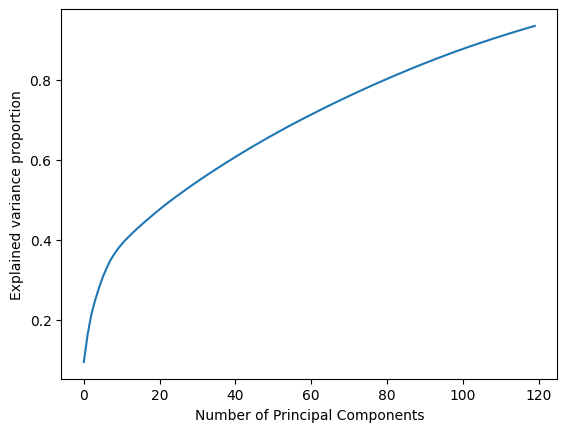
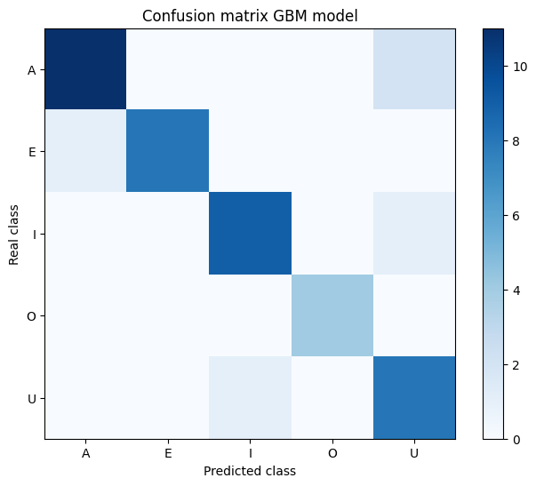

## Vowel Classification using EMG signals :chart_with_upwards_trend:

---

### LightGBM model - extended version V1
This version of the model uses the complete data for classification, the data includes signal recorde from 8 different electrodes, data from a gyroscope (3-dimensional) and data from acceleration recordings (also 3-dimensional). With this, the composition of each recording has shape (400, 14), 400 rows of data from 14 different points ([e1	e2	e3	e4	e5	e6	e7	e8	gx	gy	gz	ax	ay	az]) corresponding to each of the data collection mechanisms described above. The classification classes are of course, the 5 vowels (A, E, I ,O, U) which were encoded to represent a numerical value in order to correctly fit the model.
The history of the experiment can be found at [gbm-extended-version-V1](https://github.com/PedroAMtz/Vowel-classification-EMG/blob/main/GBM-for-Vowel-identification.ipynb).

**Results**
Results for this version of the model (extended version-includes all data) show the well performance of the model using the testing dataset of the data. 

**Classification Report:**

| Vowel  | Precision | Recall | F1-Score | Support |
|---|-----------|--------|----------|---------|
| A | 1.00      | 0.92   | 0.96     | 13      |
| E | 0.89      | 0.89   | 0.89     | 9       |
| I | 0.80      | 0.80   | 0.80     | 10      |
| O | 0.80      | 1.00   | 0.89     | 4       |
| U | 0.89      | 0.89   | 0.89     | 9       |

**Accuracy:** 0.89

**Macro Avg:**
  - Precision: 0.88
  - Recall: 0.90
  - F1-Score: 0.89

**Weighted Avg:**
  - Precision: 0.89
  - Recall: 0.89
  - F1-Score: 0.89
  - Support: 45

---

### LightGBM model - reduced data version V2

This version of the model includes exactly the same version of data used in the extended version model, but this time we implement a dimensionality reduction algorithm in order to decrease the size of input vectors, for this PCA was used and a number of 120 components reduced from the original 5600 components. But with this approach the experiment still uses all data collection mechanisms used to record the EMG signals (electrodes, gyroscope, acceleration). Th classification criteria is the same, multi class classification for vowels (A, E, I, O , U) and the confuguration of the Lgbm model trained are the same from model V1. The history of the experiment can be found at [gbm-extended-version-V2](https://github.com/PedroAMtz/Vowel-classification-EMG/blob/main/GBM-for-Vowel-identification-V2.ipynb).

**Results**

*PCA cumulative variance ratio*

Results for this version of the model (reduced data version) show the well performance of the model using the testing dataset of the data. 

**Classification Report:**

| Vowel | Precision | Recall | F1-Score | Soporte |
|-------|-----------|--------|----------|---------|
| A     | 0.92      | 0.85   | 0.88     | 13      |
| E     | 1.00      | 0.89   | 0.94     | 9       |
| I     | 0.90      | 0.90   | 0.90     | 10      |
| O     | 1.00      | 1.00   | 1.00     | 4       |
| U     | 0.73      | 0.89   | 0.80     | 9       |

**Accuracy:** 0.89

**Macro Avg:**
  - Precision: 0.91
  - Recall: 0.90
  - F1-Score: 0.90

**Weighted Avg:**
  - Precision: 0.90
  - Recall: 0.89
  - F1-Score: 0.89
  - Soporte: 45
